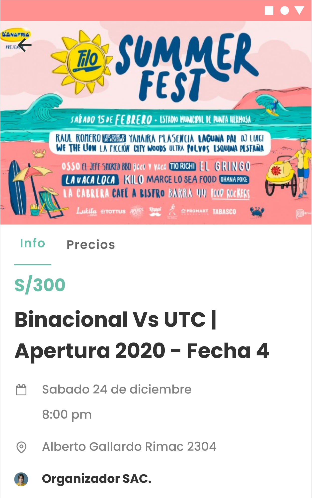

# LAB | React Native - Festival Tickets Clone

## Learning Goals

This exercise allows you to practice and apply the concepts and techniques taught in class.

Upon completion of this exercise, you will be able to:

- Convert UI prototypes into actual code implementation.
- Implement UI in react native applications.
- Apply react native core components to achieve UI requirements.
- Create components to split UI screens into multiple re-usable pieces.

## Introduction

In this lab, we will be building a basic festival tickets screen:



<br>

All of the necessary assets and images are already provided on this [Figma Prototype](https://www.figma.com/file/2dbcZ49p1RP1CwhVBY8zMR/LAB---RN-FESTIVAL-CLONE?type=design&node-id=0%3A1&mode=design&t=VJ8vSGie6pa8Jubh-1).

## Requirements

- Fork this repo
- Clone this repo

## Submission

Upon completion, run the following commands:

```shell
git add .
git commit -m "done"
git push origin master
```

Create Pull Request so your TAs can check up your work.

## Instructions

You are provided with some assets - in the `images` and `icons` folders, you will find the necessary images. Write your React and StyleSheets code in the `App.tsx` file. Again, remember to follow the best practices and ideally split the UI into re-usable components.

:muscle: :muscle: :muscle:

Let's do this!

### Iteration 1: The Header

- Remove the react-native boilerplate code from the `App.tsx` file.
- Render the image.
- Change the color of the `StatusBar`.

### Iteration 2: Tab component

- Implement the Tabs for `Info` and `Price`
- Functionality is out of the scope, you should only render the section.

### Iteration 3: Details section

- Implement the Details section with the following elements:
  - Price
  - Event Title
  - Date
  - Place
  - Organizer
  - Description
  - Map image

### Iteration 4: The buy ticket button

- Create the button to buy tickets, keep in mind this should be always on the bottom of the screen.

### Bonus

#### Bonus iteration: Similar Events section

- Implement the Similar events section with the following:
  - Similar events title
  - Similar events cards
    - Image for the event
    - Event Title
    - Date and Time
    - price

<br>

**Happy coding!** :heart:
